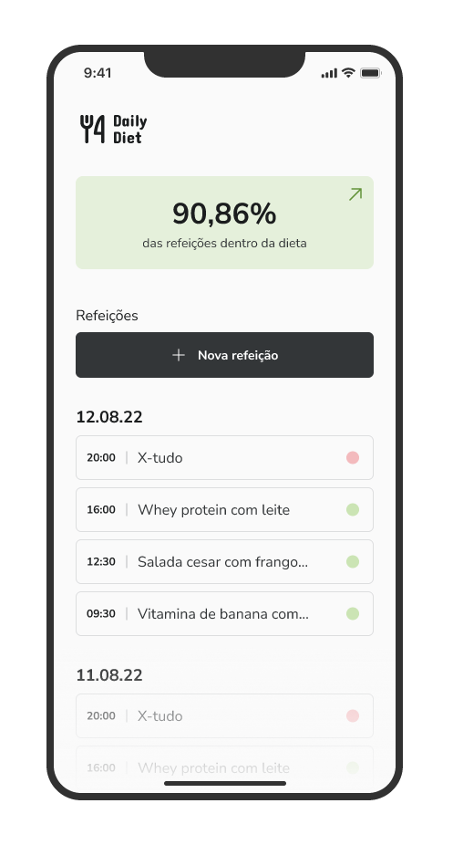
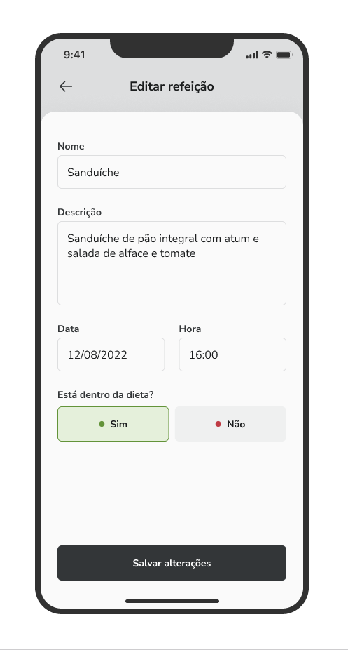
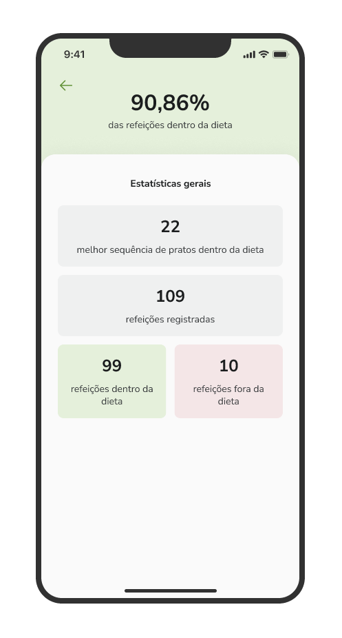

<h1 align="center" style="font-size:36px;">Daily diet 🥗</h1>

A API foi criada com o objetivo de rastrear e registrar todas as refeições feitas 
por um usuário ao longo do dia.

Ao realizar o registro, um cookie é gerado e armazenado para posterior validação. Este cookie será adicionado à coluna 'session_ID' na tabela 'users'.Posteriormente, utilizaremos esse identificador para autenticar o usuário que está inserindo uma nova refeição, permitindo-nos associar o ID do usuário à tabela 'meals'.

<p align="center">
  
  
  
   
</p>

## Tecnologias 
- [Knex](https://knexjs.org/)
- [Zod](https://zod.dev/)
- [Fastify](https://fastify.dev/)
- [Vitest](https://vitest.dev/)

## Regras da aplicação

  - [x] Deve ser possível criar um usuário
  - [x] Deve ser possível identificar o usuário entre as requisições
  - [x] Deve ser possível registrar uma refeição feita, com as seguintes informações:  
      - Nome
      - Descrição
      - Data e Hora
      - Está dentro ou não da dieta
  - [x] Deve ser possível editar uma refeição, podendo alterar todos os dados acima
  - [x] Deve ser possível apagar uma refeição
  - [x] Deve ser possível listar todas as refeições de um usuário
  - [x] Deve ser possível visualizar uma única refeição
  - [x] Deve ser possível recuperar as métricas de um usuário
      - Quantidade total de refeições registradas
      - Quantidade total de refeições dentro da dieta
      - Quantidade total de refeições fora da dieta
      - Melhor sequência por dia de refeições dentro da dieta
  - [x] O usuário só pode visualizar, editar e apagar as refeições o qual ele criou

## Instalação

```bash
# Faça o clone do repo
  git clone git@github.com:matheusgmello/daily-diet-api.git

# Instale as dependências
  npm install

# Execute o projeto
  npm run dev
  
# Rodar as migrations 
  npm run knex -- migrate:latest
```
## Insomnia do projeto
[](https://insomnia.rest/run/?label=ignite-daily-diet-api-insomniaConfigs&uri=https%3A%2F%2Fraw.githubusercontent.com%2Fmatheusgmello%2Fdaily-diet-api%2Fmain%2FExport-Insomnia.json)

## Rotas
- Criar novo usuário
```bash
POST /users
```

- Criar registro de uma refeição
```bash
POST /meals
```

- Listar todas refeições feitas pelo usuário
```bash
GET /meals
```

- Listar uma refeição específica feita pelo usuário
```bash
GET /meals/:${meal_id}
```

- Apresentar um resumo abrangente das refeições registradas pelo usuário, incluindo o total de refeições, aquelas que estão dentro da dieta e as que estão fora da dieta.
```bash
GET /meals/summary
```

- Deletar uma refeição cadastrada
```bash
DELETE /meals/:${meal_id}
```

- Editar uma refeição cadastrada
```bash
PUT /meals/:${meal_id}
```
## Testes automatizados
  - [x] Should be able to create a new account
  - [x] Should be able to create a new meal
  - [x] Should be able to list all meals
  - [x] Should be able to get a specific meals
  - [x] Should be able to get the summary meals
  - [x] Should be able to delete a specific meal
  - [x] Should be able to edit a meal

## Informações

[](https://www.linkedin.com/in/matheusgmello/)

Feito durante o bootcamp Ignite da [Rocketseat](https://rocketseat.com.br)💜


