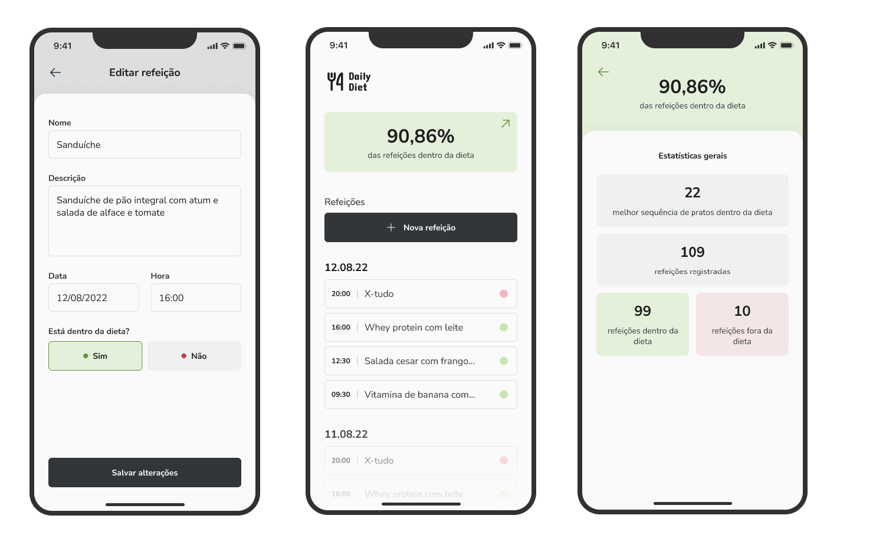

# Daily Diet

Gerencie sua dieta, registre refeições e acompanhe seu progresso para alcançar seus objetivos de saúde através do aplicativo.

# Configurações

### Requisitos
- [Node.js](https://nodejs.org/en/)
- [PNPM](https://pnpm.io/)
- [Docker & DockerCompose](https://docs.docker.com/)


**Clone o projeto e acesse a pasta**

```bash
git clone git@github.com:matheusgmello/daily-diet.gits && cd daily-diet
```
**Siga estes passos**

```bash
# Instala as dependências 
$ pnpm install

# Rode o banco de dados
$ docker compose up -d
```

Backend: [Back-end - Passo a passo](./packages/api/README.md)

Mobile: [Mobile - Passo a passo](./packages/mobile/README.md)

## Tecnologias
- [React Native](https://reactnative.dev/)
- [Expo](https://expo.dev/)
- [Expo Router](https://docs.expo.dev/guides/routing-and-navigation/)
- [React Query](https://tanstack.com/query/latest/)
- [AdonisJS](https://adonisjs.com/)

<!--START_SECTION:footer-->
<br />

## 🔗 Connect with me
[](https://linkedin.com/in/matheusgmello)
[](https://www.reddit.com/user/math7zw)
[](https://github.com/matheusgmello/)


<!--END_SECTION:footer-->